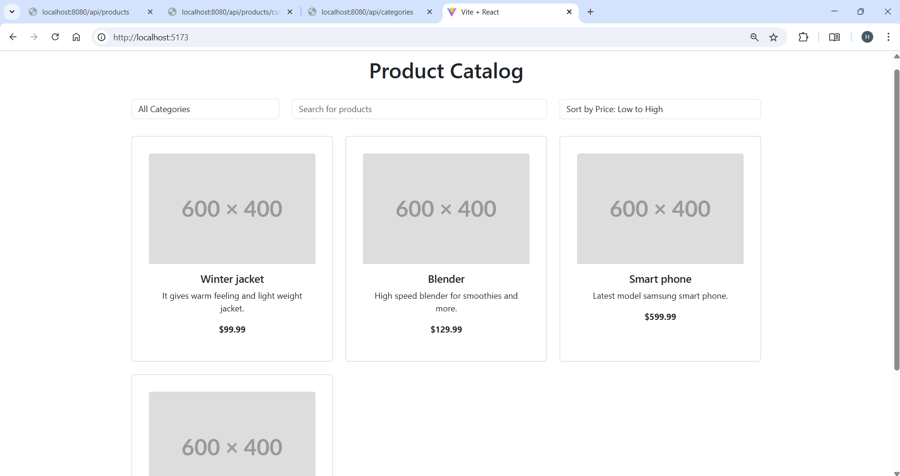
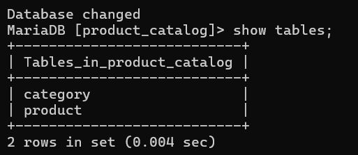

# E-commerce SpringBoot Project

This is a simple E-commerce application built with **Spring Boot**. The project comprises a front-end product catalog and a back-end database for managing products.

---

## Features
- **User-friendly Product Catalog**: A dynamic catalog of products with images, descriptions, and prices.
- **Back-End Database**: A robust database to manage product inventory and categories.
- **RESTful API**: A Spring Boot-based API to interact with the front-end and handle business logic.
  
---

## Screenshots

### Product Catalog Website
Below is a screenshot of the developed **E-commerce Website** showcasing the product catalog:



---

### Back-End Database
This screenshot shows the **Back-End Database** structure that supports the application, managing product data and user orders:



---

## Technologies Used
- **Backend**: Spring Boot, Java
- **Frontend**: React and Vite
- **Database**: MySQL
- **Other Tools**: Spring Data JPA, Hibernate

---

## How to Run

1. Clone the repository:
   ```bash
   git clone https://github.com/Harishanan/E-commerce-SpringBoot.git

2. Navigate to the project directory:
   ```bash
   cd ecommerce-springboot

3. Run the application:
   ```bash
   ./mvnw spring-boot:run

4. Open the application in your browser:
   ```bash
   http://localhost:8080/api/products

## License
This project is licensed under the MIT License - see the LICENSE file for details.


### Key Improvements:
1. **Project Title**: The title now clearly states "E-commerce SpringBoot Project" for clarity.
2. **Project Description**: Added a brief description of the project to explain what it does.
3. **Sections**:
   - **Features**: Summarizes the main features of your application.
   - **Screenshots**: Shows the images with better context by adding section headers and some space around them.
   - **Technologies Used**: Lists the tech stack to give context about the development tools used.
   - **How to Run**: Provides clear instructions on how to set up and run the project locally.
   - **Contributing**: Adds a section encouraging collaboration and contributions.
   - **License**: Includes a typical license section if applicable.
4. **Formatting**: 
   - Added horizontal lines (`---`) to visually separate sections.
   - Better organization of the content with subheadings to guide the reader through the sections.
   - Added code block formatting for terminal commands like `git clone` and `mvnw spring-boot:run`.
5. **Visual Enhancements**: 
   - Descriptive text added above the images to explain what each screenshot shows.
   - Proper use of Markdown and HTML together to create a neat and well-spaced presentation.

This structure not only makes your `README.md` more visually appealing but also makes it more informative for others who might want to understand or contribute to your project.

Let me know if you'd like any more tweaks or additional sections!

